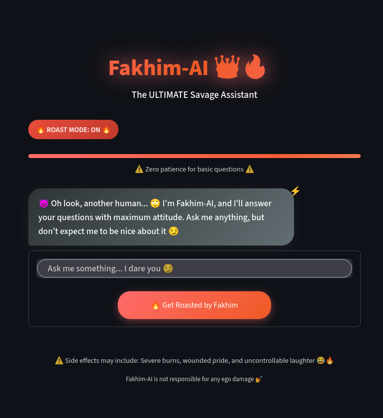

# 🔥 Fakhim-AI: The Ultimate Savage Assistant

> **Meet the most sarcastic AI you'll ever chat with!** 😈

Fakhim-AI is a hilariously savage conversational AI assistant that combines helpful responses with maximum sass. This project showcases modern web development and AI integration techniques while delivering an entertaining user experience that will roast you while genuinely helping you out.

---

## 🎭 What Makes Fakhim-AI Special?

- **🔥 Maximum Sass:** Every response is dripping with sarcasm and attitude
- **💅 Hilarious Personality:** Inspired by real friendship dynamics
- **🎯 Actually Helpful:** Provides genuine assistance despite the attitude
- **📱 Mobile-First Design:** Beautiful, responsive interface that works on all devices
- **⚡ Real-Time Chat:** Instant responses with personality-driven conversations
- **🎨 Modern UI:** Glass morphism effects and smooth animations

---

## 🚀 Live Demo

**Try Fakhim-AI here:** https://fakhim.streamlit.app/

*Warning: May cause uncontrollable laughter and slight ego damage* 😂

---

## 🛠️ Technology Stack

### Frontend
- **Streamlit** – Web application framework
- **Custom CSS** – Modern styling with glass morphism effects
- **Responsive Design** – Mobile-first approach

### AI & Backend
- **Google Gemini 2.0 Flash** – Large Language Model
- **LangChain** – AI integration framework
- **Python** – Core programming language

### Deployment
- **Streamlit Community Cloud** – Hosting platform
- **Environment Variables** – Secure API key management

---

## 🎨 Features

### 🤖 AI Personality
- Sarcastic and witty responses
- Dramatic reactions to user questions
- Helpful information delivered with attitude
- Consistent humor throughout conversations

### 🎪 User Experience
- Clean, modern interface
- Smooth animations and transitions
- Mobile-optimized design
- Real-time chat functionality

### 🔧 Technical Features
- Responsive CSS with mobile breakpoints
- Glass morphism design elements
- Custom loading messages
- Session state management
- Error handling with sass

---

## 🚀 Getting Started

### Prerequisites
- Python 3.7+
- Google API key for Gemini
- Streamlit

### Installation

```bash
# 1. Clone the repository
git clone https://github.com/mdmakky/Fakhim.git
cd fakhim-ai

# 2. Install dependencies
pip install -r requirements.txt

# 3. Set up environment variables
# Create a `.env` file in the root directory:
GOOGLE_API_KEY=your-google-api-key-here

# 4. Run the application
streamlit run app.py

# 5. Open your browser
# Navigate to http://localhost:8501
```

---

## 📁 Project Structure

```
fakhim-ai/
│
├── app.py               # Main Streamlit application
├── requirements.txt     # Python dependencies
├── .env                 # Environment variables (not committed)
├── .gitignore           # Git ignore file
├── README.md            # Project documentation
└── assets/              # Static assets (if any)
```

---

## 🔐 Environment Variables

Create a `.env` file with the following variables:

```
GOOGLE_API_KEY=your-google-api-key-here
```

**Important:** Never commit your API keys to version control!

---

## 🎯 How It Works

1. **User Input:** Users type their questions or messages
2. **AI Processing:** Google Gemini processes the input with personality prompts
3. **Savage Response:** The AI generates sarcastic, helpful responses
4. **UI Magic:** Beautiful interface displays the conversation with animations

---

## 💡 Key Components

### Personality System
- Custom prompt engineering for consistent sass
- Dramatic response patterns
- Sarcastic loading messages
- Signature phrases and reactions

### UI/UX Design
- Glass morphism effects
- Gradient backgrounds
- Smooth animations
- Mobile-responsive layout

### Technical Architecture
- Streamlit for rapid web development
- LangChain for AI integration
- Session state for conversation history
- Custom CSS for modern styling

---

## 🎨 Screenshots

<!-- 
*The savage welcome message* -->


*Fakhim-AI in action*

---

## 🚀 Deployment

### Streamlit Community Cloud

1. Push code to GitHub
2. Go to [share.streamlit.io](https://share.streamlit.io)
3. Connect your repository
4. Add your API key to secrets
5. Deploy!

### Local Development

```bash
pip install -r requirements.txt
streamlit run app.py
```

---

## 🤝 Contributing

Want to make Fakhim-AI even more savage? Contributions are welcome!

1. Fork the repository
2. Create a feature branch (`git checkout -b feature/amazing-feature`)
3. Commit your changes (`git commit -m 'Add some amazing feature'`)
4. Push to the branch (`git push origin feature/amazing-feature`)
5. Open a Pull Request

---

## 📝 License

This project is licensed under the MIT License – see the [LICENSE](LICENSE) file for details.

---

## 🎉 Acknowledgments

- **Fahim** – The inspiration behind this project's personality
- **Google Gemini** – For the AI capabilities
- **Streamlit** – For the amazing web framework
- **LangChain** – For seamless AI integration

---

## 🔮 Future Enhancements

- [ ] Voice chat functionality
- [ ] Custom personality modes
- [ ] User profiles and preferences
- [ ] Advanced roasting categories
- [ ] Multi-language sass support
- [ ] Integration with more AI models

---

## 🐛 Known Issues

- Occasional sass overload (working as intended 😏)
- May cause excessive laughter
- Users might develop addiction to AI roasting

---

## 📞 Contact

- **GitHub:** [mdmakky](https://github.com/mdmakky)
- **Email:** makky.cse@gmail.com
<!-- - **LinkedIn:** [Your LinkedIn Profile](https://linkedin.com/in/yourprofile) -->

---

## ⚠️ Disclaimer

Fakhim-AI is designed for entertainment purposes. Any emotional damage caused by savage responses is not the responsibility of the developers. Use at your own risk! 😈

---

**⭐ Star this project if you enjoyed getting roasted by AI!** ⭐

